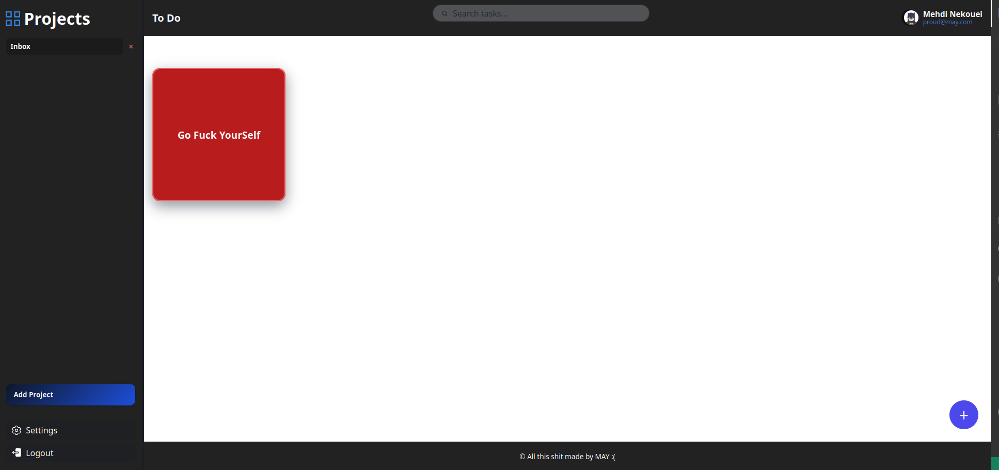

## **📝 To-Do List App**

A modular and clean JavaScript To-Do List application built for The Odin
Project.
This app allows users to create projects, add todos, edit them, and
organize tasks efficiently.

------------------------------------------------------------------------

## **📸 Preview**

 

------------------------------------------------------------------------

## **🚀 Features**

✅ Core Functionality

-   Create unlimited projects
-   Add todo cards inside each project
-   Each todo includes:
    -   Title
    -   Description
    -   Due date
    -   Note
    -   Completion toggle
-   Edit & delete todos
-   Edit project titles
-   Default Inbox project on first load

------------------------------------------------------------------------

 🧩 Architecture

The project uses a modular ES Modules structure. Each module handles one
part of the logic:

  -----------------------------------------------------------------------
  Module                  Responsibility
  ----------------------- -----------------------------------------------
  todo-factory.js         Creates todo objects

  todo-CRUD.js            CRUD controller for todos

  projects.js             Project creation & todo management inside each
                          project

  dom.js                  All DOM rendering and UI updates

  index.js                App core logic & initialization

  styles.css              Main styling file
  -----------------------------------------------------------------------

------------------------------------------------------------------------

## **📂 Project Structure**

    /src
      ├── index.js
      ├── dom.js
      ├── styles.css
      ├── todo-factory.js
      ├── todo-CRUD.js
      ├── projects.js
      └── images/
            ├── settings.svg
            ├── logout.svg
            └── project.svg

------------------------------------------------------------------------

## **🛠️ Technologies Used**

-   JavaScript (ES6 Modules)
-   HTML5 & CSS3
-   Webpack (bundler)
-   Optional: LocalStorage (for future persistence)

------------------------------------------------------------------------

##  **▶️ How to Run Locally**

1. Clone the repository

    git clone https://github.com/may-zone/ToDo-List

2. Install dependencies

    npm install

3. Start development server

    npm run dev

4. Build for production

    npm run build

------------------------------------------------------------------------

## **🧪 Future Improvements**

-   Add LocalStorage integration
-   Todo priority levels
-   Global search or filtering
-   UI animations and transitions
-   Dark mode

------------------------------------------------------------------------

## **📄 License**

This project is licensed under the MIT License.
